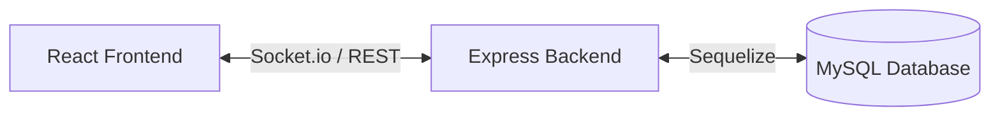

<div align="center">

# 🏥 FamilyCare – Eldercare Monitoring System

**"Stay connected. Stay caring. Anytime, anywhere ❤️"**

[](https://opensource.org/licenses/MIT)
[](https://reactjs.org/)
[](https://nodejs.org/)
[](https://www.mysql.com/)
[](https://socket.io/)

---

FamilyCare is a premium full-stack platform designed for families abroad to monitor and manage the health and daily well-being of their parents with transparency and professional care.

</div>

---

### 🧠 Problem Statement
Elderly parents often live alone while their children work overseas. This distance makes it difficult to monitor daily health vitals (like blood pressure and medicine intake) or know if they are receiving proper care. Traditional communication methods are periodic and non-data-driven.

### 💡 Solution Overview
FamilyCare bridges this clinical gap by connecting families with caregivers. Caregivers log daily vitals directly into the system, which are then synchronized in real-time to the children's dashboard, providing a clear window into their parents' well-being.

---

### 🚀 Key Features
- **🔐 Multi-Role Access:** Secure environments for Children and professional Caregivers.
- **👴 Elder Profiles:** Manage multiple parent records in one place.
- **📋 Caregiver Marketplace:** Browse and assign vetted care professionals.
- **🩺 Clinical Logging:** Track BP, pulse, temp, meals, and medication daily.
- **⚡ Live Sync:** Instant health updates using Socket.io.
- **📊 Data Visualization:** Chart.js-powered dashboards for tracking health trends.
- **🔮 Future Ready:** Planned features for one-tap emergency services.

---

### 🏗️ System Architecture
FamilyCare uses a highly reliable **Relational Data Architecture (MySQL)** for maximum data consistency and ACID compliance.

<div align="center">
  


</div>

---

### 🗄️ Database Design
We use **MySQL** to ensure that medical logs are strictly validated and consistently linked between caregivers, children, and parents.

- **`Users`**: Management of credentials and roles.
- **`Elders`**: Detailed profiles for parents under care.
- **`Caregivers`**: Specialized profiles with certifications and availability.
- **`HealthLogs`**: Historical records of clinical vitals and activities.

---

### ⚙️ Tech Stack
| Component | Technology |
|---|---|
| **Frontend** | React.js, Vite, Chart.js, Axios |
| **Backend** | Node.js, Express.js, Socket.io |
| **Database** | MySQL, Sequelize (ORM) |
| **Deployment** | Vercel (Frontend), Render (Backend) |

---

### 🛠️ Quick Installation Guide

<details>
<summary><b>1. Backend Setup</b></summary>

```bash
cd backend
npm install
cp .env.example .env
npm run dev
```

</details>

<details>
<summary><b>2. Frontend Setup</b></summary>

```bash
cd frontend
npm install
cp .env.example .env
npm run dev
```

</details>

<details>
<summary><b>3. Database Initialization</b></summary>

```bash
mysql -u root -p < backend/src/database/schema.sql
```

</details>

---

### 📂 Folder Structure
```text
├── 📁 assets/       # Visuals and images
├── 📂 backend/      # Express API & MySQL Schema
├── 📂 frontend/     # React SPA & Context Logic
└── 📄 README.md     # Project Documentation
```

---

### 👨💻 Contributors
- **Member 1** - API & Database Architecture
- **Member 2** - Premium UI/UX Development
- **Member 3** - State Management & Auth Integration

---

<div align="center">
  <p>Made with ❤️ for the Elderly</p>
  <a href="#">Back to Top</a>
</div>
