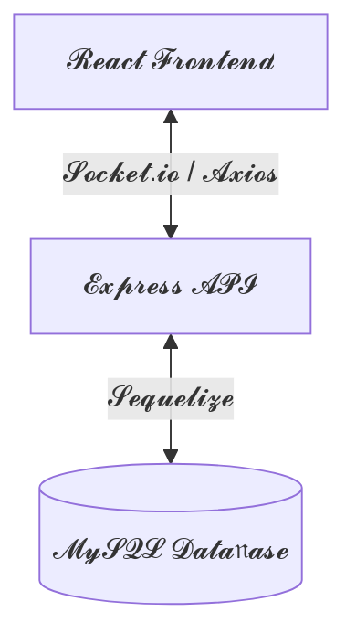

<div align="center">

# 𝓕𝓪𝓶𝓲𝓵𝔂𝓒𝓪𝓻𝓮 – 𝓔𝓵𝓭𝓮𝓻𝓬𝓪𝓻𝓮 𝓜𝓸𝓷𝓲𝓽𝓸𝓻𝓲𝓷𝓰 𝓢𝔂𝓼𝓽𝓮𝓶

### 𝓢𝓽𝓪𝔂 𝓒𝓸𝓷𝓷𝓮𝓬𝓽𝓮𝓭. 𝓢𝓽𝓪𝔂 𝓒𝓪𝓻𝓲𝓷𝓰. 𝓐𝓷𝔂𝓽𝓲𝓶𝓮, 𝓐𝓷𝔂𝔀𝓱𝓮𝓻𝓮 ❤️

[](https://opensource.org/licenses/MIT)
[](https://reactjs.org/)
[](https://nodejs.org/)
[](https://www.mysql.com/)

---

FamilyCare is a premium web platform that allows families working abroad to monitor and manage the health of their elderly parents in real-time. By bridging clinical care with professional caregivers, we provide transparency and peace of mind for loved ones, no matter the distance.

</div>

---

> [!NOTE]
> **The Problem:** Children abroad often miss critical health trends for their parents. Traditional check-ins lack clinical data, creating anxiety and monitoring gaps.

> [!TIP]
> **The Solution:** A centralized, data-driven platform where caregivers log vitals (BP, Heart Rate, Meals) directly into a real-time dashboard accessible by family members globally.

---

### 🚀 ✨ Key Capabilities

- **🔐 Authenticated Roles:** Distinct interfaces for **Children (Family)** and professional **Caregivers**.
- **👴 Elder Profile Management:** Create and manage distinct profiles for each parent with medical history.
- **📋 Expert Matchmaking:** Browse and assign caregivers based on experience, rating, and specialization.
- **🩺 Precision Health Logging:** Daily reporting for blood pressure, heart rate, temperature, and medication.
- **⚡ Real-time Synchronization:** Built with **Socket.io** for instantaneous health updates.
- **📊 Health Trends:** Beautifully visualized health data using **Chart.js** for early anomaly detection.

---

### 🏗️ ✨ System Architecture

<div align="center">



*Relational data integrity ensures clinical accuracy across all modules.*

</div>

---

### ⚙️ ✨ Tech Stack

| 𝓛𝓪𝔂𝓮𝓻 | 𝓣𝓮𝓬𝓱𝓷𝓸𝓵𝓸𝓰𝔂 |
| :--- | :--- |
| **𝓕𝓻𝓸𝓷𝓽𝓮𝓷𝓭** | React 18, Vite, React Router, Chart.js |
| **𝓑𝓪𝓬𝓴𝓮𝓷𝓭** | Node.js, Express.js |
| **𝓡𝓮𝓪𝓵-𝓽𝓲𝓶𝓮** | Socket.io |
| **𝓓𝓪𝓽𝓪𝓫𝓪𝓼𝓮** | MySQL 8.0+, Sequelize ORM |
| **𝓓𝓮𝓹𝓵𝓸𝔂𝓶𝓮𝓷𝓽** | Vercel (UI), Render (API) |

---

### 🛠️ ✨ Setup & Installation

#### 📦 1. Clone & Install
```bash
git clone https://github.com/dilshandevxx/FamilyCare-Univercity-Project.git
npm run install:all
```

#### 🔑 2. Environment Configuration
Create a `.env` in both folders matching the `.env.example` templates for your MySQL credentials.

#### 🚀 3. Start Development
```bash
npm run dev:backend  # API starts at localhost:5000
npm run dev:frontend # Vite starts at localhost:5173
```

---

### 🔮 ✨ Roadmap: The Future of Care

- **🚑 One-Tap Emergency:** Instant integration with local emergency responder APIs.
- **💊 AI Med-Reminders:** Smart notifications based on logged health records.
- **📞 Direct Consultation:** Integrated video calls with family doctors.
- **📱 Native Performance:** Dedicated apps for iOS and Android.

---

<div align="center">

---

⭐ **If you find this project helpful, please consider giving it a star!** ⭐

[**Report Bug**](https://github.com/dilshandevxx/FamilyCare-Univercity-Project/issues) • [**Request Feature**](https://github.com/dilshandevxx/FamilyCare-Univercity-Project/issues) • [**Contribute**](https://github.com/dilshandevxx/FamilyCare-Univercity-Project/pulls)

© 2026 FamilyCare Team. Licensed under [MIT](LICENSE).

</div>
